---
type:
  - Style
  - in Note
  - Block
---
### ℹ️ Description
---
- 다이어그램을 그리는 코어 기능(플러그인은 아님)^desc-1

### 🛠️ How to use?
---
#### Gantt
---
1. 블럭에 `mermaid` 입력, 다음 줄에 `gantt` 입력
   \`\`\`mermaid
   gantt
   \`\`\`
2. 제목, 날짜 형식, 구역, 할일 작성
   \`\`\`mermaid
   gantt
       title 2026년 1분기 계획
       dateFormat YYYY-MM-DD
       section 스터디
           코루틴 학습 : id1, 2026-03-01, 14d
           컴포즈 학습 : after id1, 28d
       section 앱 개발
           기획 : 2026-04-01, 14d
           개발 : 14d
   \`\`\`
3. 완성
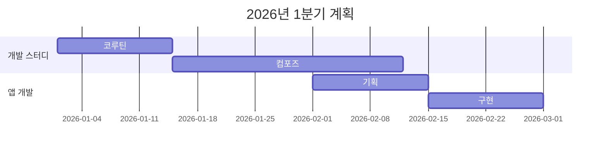

##### Flowchart
---
1. 블럭에 `mermaid` 입력, 다음 줄에 `flowchart`와 다이어그램 방향(Direction) 입력
   \`\`\`mermaid
   flowchart LR
   \`\`\`
2. 노드(Node)와 관계(Relation/Edge) 작성
   \`\`\`mermaid
   flowchart LR
       A\[시작\] --> B{조건 확인}
       B --> |Yes| C\[처리\]
       B --> |No| D\[종료\]
       C --> D
   \`\`\`
3. 완성
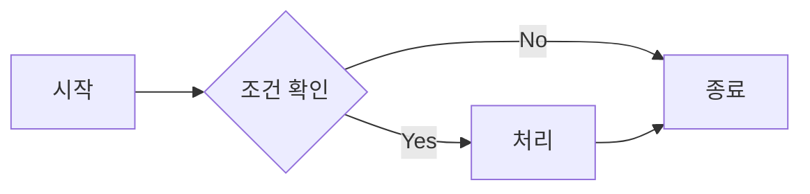
##### ➕ Extra
---
- 방향: `TB`, `BT`, `LR`, `RL`
- 노드: `[사각형]`, `(둥근 사각형)`, `{마름모}`, `([경기장형])`, `[[서브루틴]]`, `((원형))`
- 연결선: `-->`(화살표), `---`(실선), `-.->`(점선 화살표), ==>(굵은 화살표)

#### Sequence Diagram
---
1. 블럭에 'mermaid' 입력, 다음 줄에 'sequenceDiagram' 입력
   \`\`\`mermaid
   sequenceDiagram
   \`\`\`
2. 참여자와 메시지 흐름 작성
   \`\`\`mermaid
   sequenceDiagram
       participant U as 사용자
       participant S as 서버
       participant DB as 데이터베이스
       U ->> S : 로그인 요청
       S ->> DB : 계정 조회
       DB -->> S : 계정 정보
       S -->> U : 로그인 성공
   \`\`\`
3. 완성
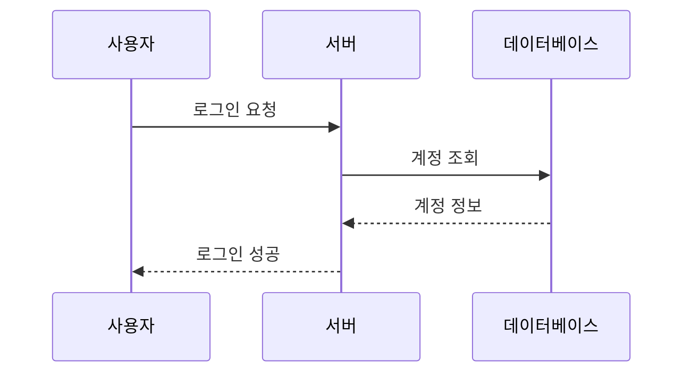
##### ➕ Extra
---
- 화살표: `->>`(실선), `-->>`(점선), `-x`(실선 X), `--x`(점선 X)
- 활성 구간 표시: `activate`, `deactivate`
- 노트 추가: `Note over A,B: 내용`

#### Class Diagram
---
1. 블럭에 `mermaid` 입력, 다음 줄에 `classDiagram` 입력
   \`\`\`mermaid
   classDiagram
   \`\`\`
2. 클래스(Class), 속성(Attribute), 메서드(Method), 관계(Relationship) 작성
   \`\`\`mermaid
   classDiagram
       class Animal {
           +String name
           +eat()
       }
       class Dog {
           +bark()
       }
       class Cat {
           +meow()
       }
       Animal <|-- Dog
       Animal <|-- Cat
   \`\`\`
3. 완성
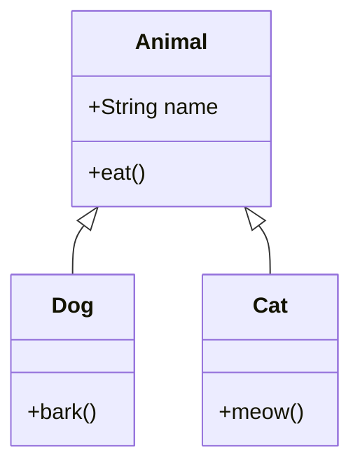
##### ➕ Extra
---
- 관계: `<|--`(상속), `*--`(합성), `o--`(집합), `-->`(연관), `..>`(의존), `..|>`(구현)
- 접근 제한자: `+`(public), `-`(private), `#`(protected), `~`(package)

#### ER Diagram
---
1. 블럭에 `mermaid` 입력, 다음 줄에 `erDiagram` 입력
   \`\`\`mermaid
   erDiagram
   \`\`\`
2. 엔티티(Entity)와 관계(Relationship) 작성
   \`\`\`mermaid
   erDiagram
       USER ||--o{ POST : writes
       USER ||--o{ COMMENT : writes
       POST ||--o{ COMMENT : has
       USER {
           int id PK
           string name
           string email
       }
       POST {
           int id PK
           string title
           string content
       }
   \`\`\`
3. 완성
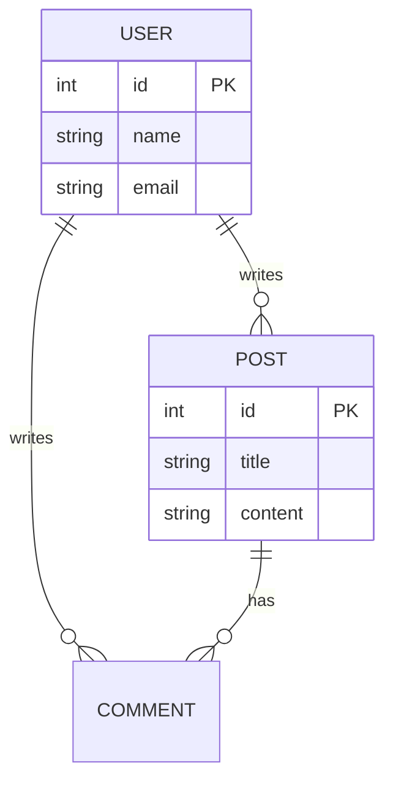
##### ➕ Extra
---
- 관계 표기: `||`(정확히 1), `o{` (0개 이상), `|{`(1개 이상), `o|`(0 또는 1)

#### State Diagram
---
1. 블럭에 `mermaid` 입력, 다음 줄에 `stateDiagram-v2` 입력
   \`\`\`mermaid
   stateDiagram-v2
   \`\`\`
2. 상태(State)와 전환(Transition) 작성
   \`\`\`mermaid
   stateDiagram-v2
       \[\*\] --> 대기
       대기 --> 처리중 : 요청 수신
       처리중 --> 완료 : 처리 성공
       처리중 --> 오류 : 처리 실패
       오류 --> 대기 : 재시도
       완료 --> \[\*\]
   \`\`\`
3. 완성
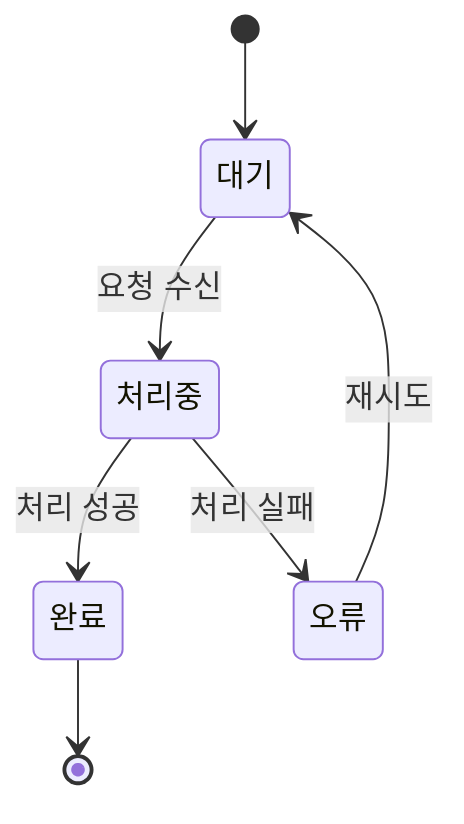
##### ➕ Extra
---
- `[*]`은 시작/종료 상태, `state "이름" as s1`으로 별칭 지정 가능
- `state 상위상태 { }`로 중첩 상태 표현 가능

#### Git Graph
---
1. 블럭에 `mermaid` 입력, 다음 줄에 `gitGraph` 입력
   \`\`\`mermaid
   gitGraph
   \`\`\`
2. 커밋(Commit), 브랜치(Branch), 머지(Merge) 작성
   \`\`\`mermaid
   gitGraph
       commit id: "초기 커밋"
       branch develop
       commit id: "기능 A 개발"
       commit id: "기능 A 완료"
       checkout main
       merge develop
       commit id: "v1.0 릴리즈"
   \`\`\`
3. 완성
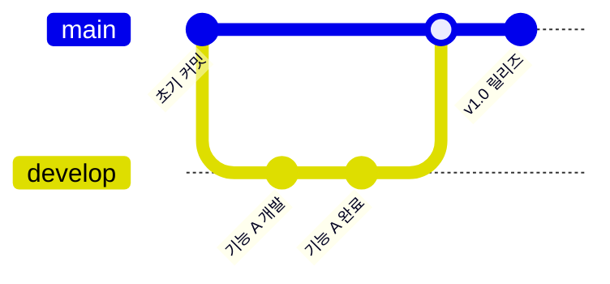
##### ➕ Extra
---
- `branch`, `checkout`, `merge`, `cherry-pick`으로 Git 워크플로 표현
- `commit type: HIGHLIGHT`로 특정 커밋 강조 가능

#### Pie Chart
---
1. 블럭에 `mermaid` 입력, 다음 줄에 `pie` 입력
   \`\`\`mermaid
   pie
   \`\`\`
2. 제목(Title)과 항목(Item) 작성
   \`\`\`mermaid
   pie title 언어 사용 비율
       "Kotlin" : 45
       "Swift" : 30
       "Dart" : 15
       "기타" : 10
   \`\`\`
3. 완성
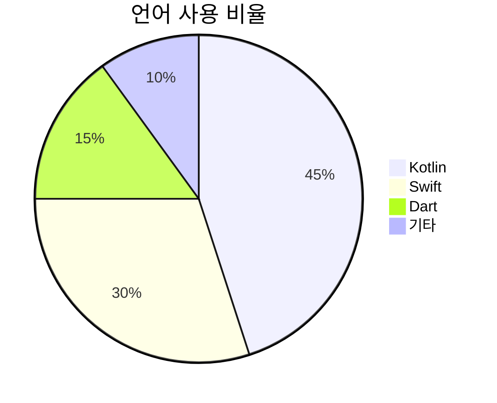

#### Quadrant Chart
---
1. 블럭에 `mermaid` 입력, 다음 줄에 `quadrantChart` 입력
   \`\`\`mermaid
   quadrantChart
   \`\`\`
2. 제목(Title), 축(Axis), 사분면(Quadrant), 데이터 포인트(Point) 작성
   \`\`\`mermaid
   quadrantChart
       title 기술 평가
       x-axis "낮은 난이도" --> "높은 난이도"
       y-axis "낮은 효용" --> "높은 효용"
       quadrant-1 "적극 도입"
       quadrant-2 "계획 수립"
       quadrant-3 "보류"
       quadrant-4 "재검토"
       Compose: \[0.7, 0.8\]
       Coroutine: \[0.5, 0.9\]
       XML Layout: \[0.3, 0.3\]
       RxJava: \[0.6, 0.4\]
   \`\`\`
3. 완성
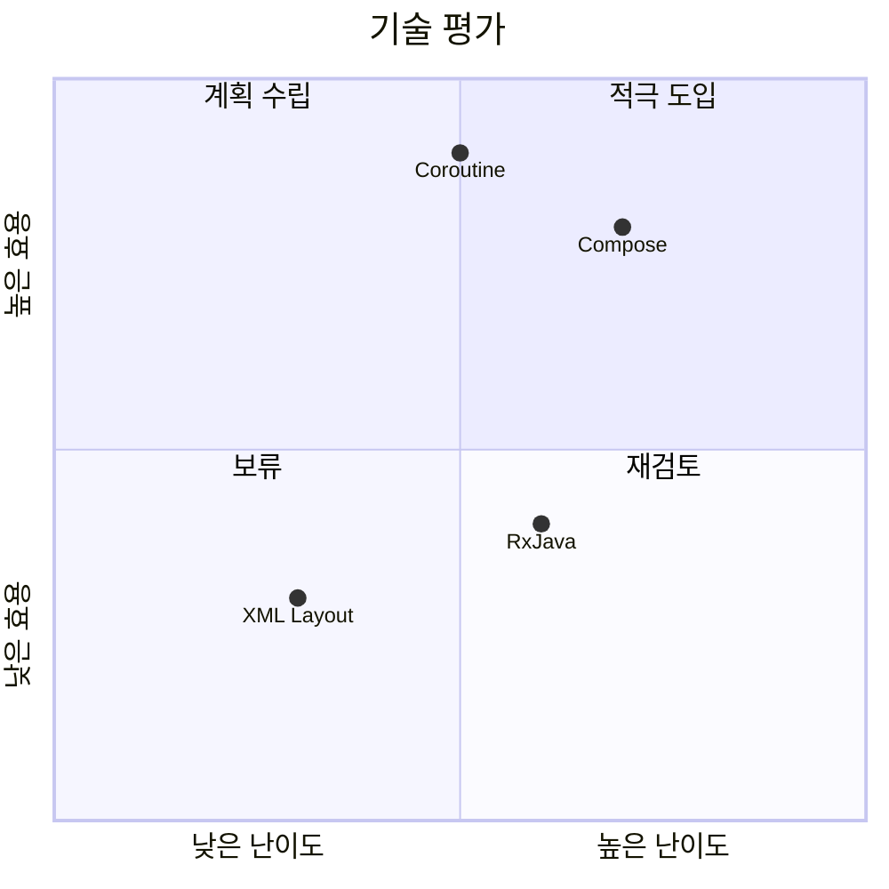
##### ➕ Extra
---
- 공백이 포함된 라벨은 `""`로 감싸야 함
- 데이터 포인트 좌표는 0.0~1.0 범위

#### Mindmap
---
1. 블럭에 `mermaid` 입력, 다음 줄에 `mindmap` 입력
   \`\`\`mermaid
   mindmap
   \`\`\`
2. 루트(Root)와 하위 노드(Child Node)를 들여쓰기로 작성
   \`\`\`mermaidㅖQ
   mindmap
       root((Android))
           UI
               Compose
               XML Layout
           비동기
               Coroutine
               Flow
           아키텍처
               MVVM
               MVI
   \`\`\`
3. 완성
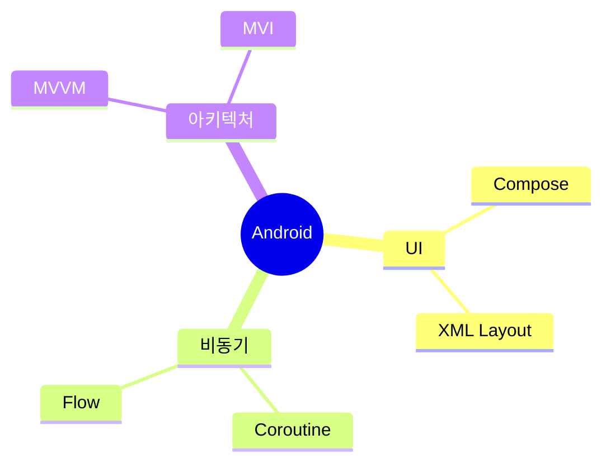
##### ➕ Extra
---
- 들여쓰기로 계층 구조 표현
- 루트 노드 모양: `((원형))`, `[사각형]`, `(둥근형)`

#### User Journey
---
1. 블럭에 `mermaid` 입력, 다음 줄에 `journey` 입력
   \`\`\`mermaid
   journey
   \`\`\`
2. 제목(Title), 구간(Section), 각 단계와 만족도(Score) 작성
   \`\`\`mermaid
   journey
       title 앱 첫 실행 경험
       section 온보딩
           앱 설치: 5: 사용자
           회원가입: 3: 사용자
           튜토리얼: 4: 사용자
       section 첫 사용
           메인 화면 진입: 4: 사용자
           핵심 기능 사용: 5: 사용자
           설정 변경: 2: 사용자
   \`\`\`
3. 완성
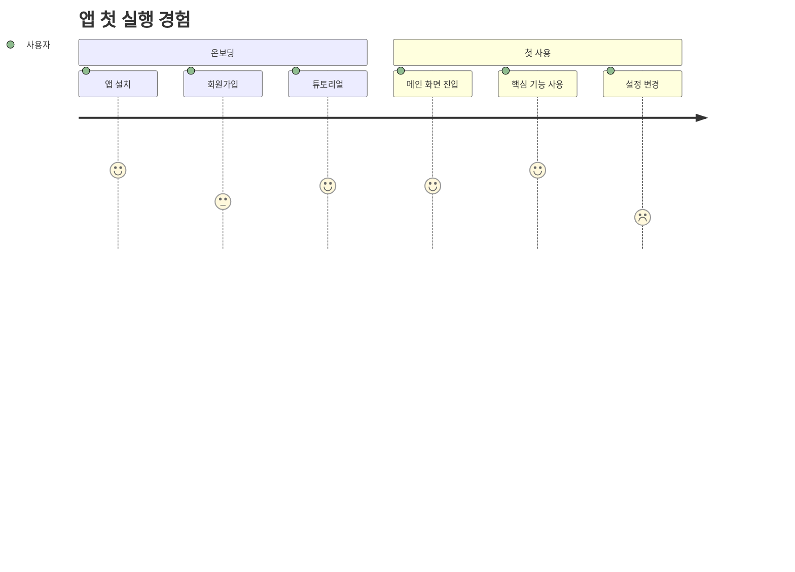
##### ➕ Extra
---
- 만족도: 1(매우 불만)~5(매우 만족)
- `section`으로 단계 구분
